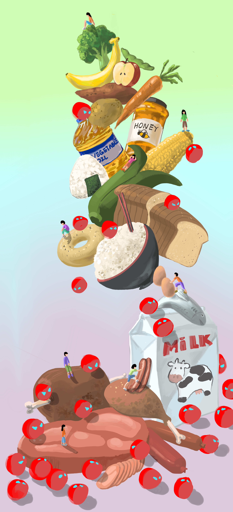
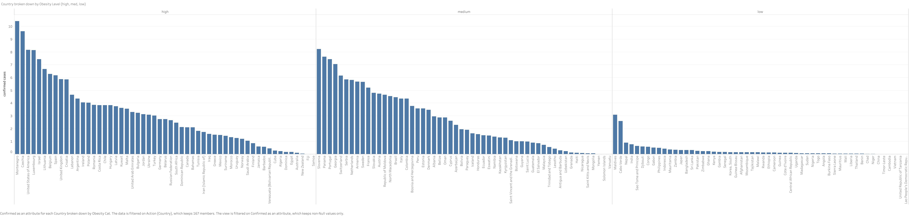
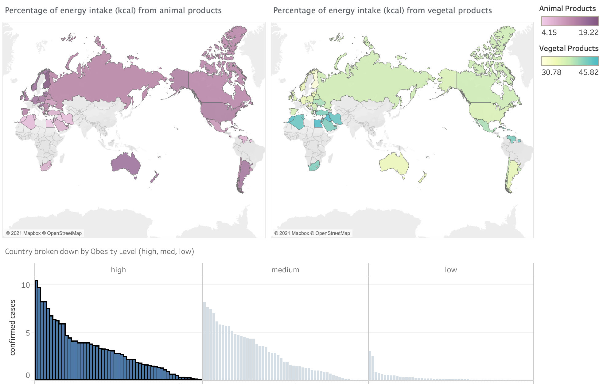
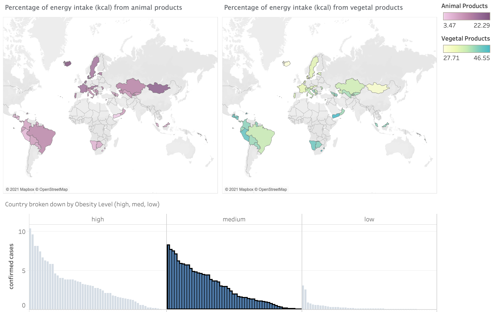
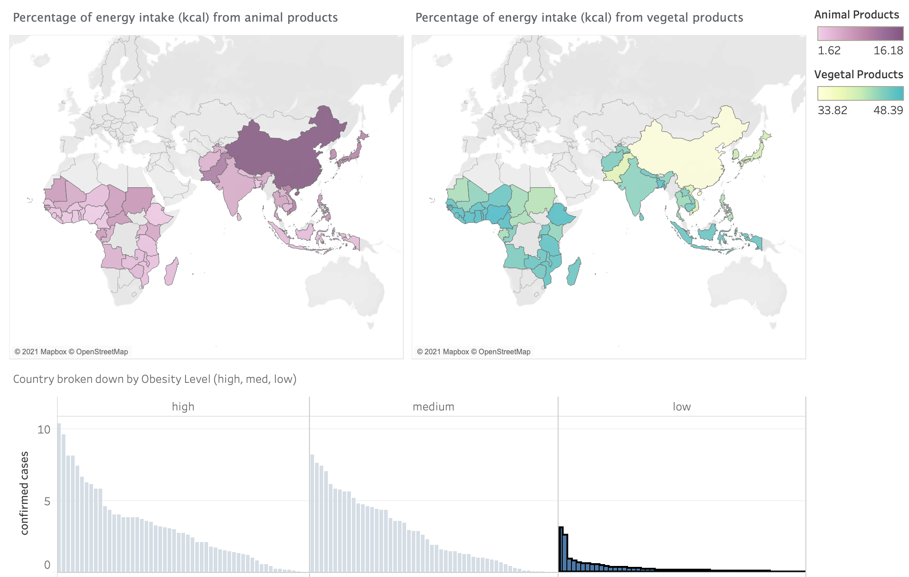

 

# Introduction:

Our project explores the relationship between diet and the infection rate of covid-19. In this presentation, we will go through why we chose this subject, how we constructed our design ideas, what tools we used in the process, and finally, our results.

### Why we chose this subject?

As I’m sure you’ve noticed, the COVID-19 pandemic has made a drastic change to our everyday lives, and we thought it would be interesting if we could find out something about this topic. We didn’t want to focus too much on heavy subjects on deaths and mortalities, we have enough of that in the news already. Instead we wanted to bring a more positive information about possible daily actions people can take to stay healthy during the pandemic.

### How we constructed our design ideas?

While going through the data on Kaggle^[Ren, Maria. “COVID-19 Healthy Diet Dataset.” Kaggle, 7 Feb. 2021, www.kaggle.com/mariaren/covid19-healthy-diet-dataset.], we came upon Bruno Viera Ribeiro’s finished analysis of the project^[Brunovr. Healthydietvscovid19. 22 Oct. 2020, www.kaggle.com/brunovr/healthydietvscovid19.], and when reading through his process, we found a couple of interesting points that we wanted to zone in by ourselves. One was the possible impact of obesity on COVID-19, to which Bruno investigated the impact on mortality rate while we focused on infected populations. Bruno had also split the obesity category into two levels, high and low, while we split it into three, high, medium, and low, for more detailed investigation. Lastly, we wanted to know what types of food in particular may have an impact on Covid-19 infection rates, which we did using regression analysis

### What we used?

For our project, we used R, Tableau, and Procreate.

# Data visualization:

### Obesity and Infection Rate

* We started our investigation with obesity rates.
* We first grouped the countries by 3 obesity levels, then plotted against covid infection rates, or, the percentage of confirmed cases.



* In this figure, we can see that countries at a lower obesity level have a lower infection rate.

* Then, we focused on Animal and Vegetal food intake of different countries. We can observe that countries with a higher obesity rate have a higher intake of Animal Products and a lower intake of Vegetal Products in terms of calories.







Now, Winnie will talk more about the relationship between diet and obesity.

### Diet and Obesity

```{r global_options, include=FALSE}
knitr::opts_chunk$set(warning = FALSE, message = FALSE)
```

```{r}
library(plotly)
library(tidyverse)
```

```{r}
setwd("/Users/macbookpro/Desktop")
DietData <- read.csv("categorized.csv")
```

```{r}
animal_features <- c('Animal.fats', 'Aquatic.Products..Other', 'Eggs',
                     'Fish..Seafood', 'Meat','Milk...Excluding.Butter',
                     'Offals')
vegetal_features <- c('Alcoholic.Beverages','Cereals...Excluding.Beer',
                      'Fruits...Excluding.Wine', 'Miscellaneous',
                      'Oilcrops', 'Pulses', 'Spices', 'Starchy.Roots',
                      'Stimulants', 'Sugar...Sweeteners','Sugar.Crops',
                      'Treenuts', 'Vegetable.Oils', 'Vegetables')
```

```{r}
DietData_Mean <- DietData  %>%
  group_by(ObesityCat) %>%
  summarise(across(.cols = all_of(animal_features), .fns = mean)) %>%
  rename(
    `Animal fats` = Animal.fats,
    `Aquatic Products Other` = Aquatic.Products..Other,
    `Eggs` = Eggs,
    `Fish, Seafood` = Fish..Seafood,
    `Meat` = Meat,
    `Milk - Excluding.Butter` = Milk...Excluding.Butter,
    `Offals` = Offals
    )

Names_All <- DietData_Mean$ObesityCat

DietData_Mean_T <- as.data.frame(t(DietData_Mean[,-1]))
colnames(DietData_Mean_T) <- Names_All

DietData_Categorized <- data.frame("Categories"=rownames(DietData_Mean_T), 
                                   DietData_Mean_T)

fig1 <- plot_ly(DietData_Categorized, 
                x = ~Categories, 
                y = ~high, type = 'bar', 
                name = 'High Obesity')
fig1 <- fig1 %>% add_trace(y = ~medium, name = 'Medium Obesity')
fig1 <- fig1 %>% add_trace(y = ~low, name = 'Low Obesity')
fig1 <- fig1 %>% layout(yaxis = list(title = 'Percentage (%)'),
                        barmode = 'Categories', 
                        title = 'Mean food intake by Animal products groups')

fig1
```

```{r}
DietData_Mean <- DietData  %>%
  group_by(ObesityCat) %>%
  summarise(across(.cols = all_of(vegetal_features), .fns = mean)) %>%
  rename(
    `Alcoholic Beverages` = Alcoholic.Beverages,
    `Cereals - Excluding Beer` = Cereals...Excluding.Beer,
    `Fruits - Excluding Wine` = Fruits...Excluding.Wine,
    `Miscellaneous` = Miscellaneous,
    `Oilcrops` = Oilcrops,
    `Pulses` = Pulses,
    `Spices` = Spices,
    `Starchy Roots` = Starchy.Roots,
    `Stimulants` = Stimulants,
    `Sugar Sweeteners` = Sugar...Sweeteners,
    `Sugar Crops` = Sugar.Crops,
    `Treenuts` = Treenuts,
    `Vegetable Oils` = Vegetable.Oils,
    `Vegetables` = Vegetables,
    )

Names_All <- DietData_Mean$ObesityCat

DietData_Mean_T <- as.data.frame(t(DietData_Mean[,-1]))
colnames(DietData_Mean_T) <- Names_All

DietData_Categorized <- data.frame("Categories"=rownames(DietData_Mean_T), 
                                   DietData_Mean_T)

fig1 <- plot_ly(DietData_Categorized, 
                x = ~Categories, 
                y = ~high, type = 'bar', 
                name = 'High Obesity')
fig1 <- fig1 %>% add_trace(y = ~medium, name = 'Medium Obesity')
fig1 <- fig1 %>% add_trace(y = ~low, name = 'Low Obesity')
fig1 <- fig1 %>% layout(yaxis = list(title = 'Percentage (%)'), 
                        barmode = 'Categories', 
                        title = 'Mean food intake by Vegetal products groups')

fig1
```

```{r}
DietData_Mean_A <- DietData  %>%
  #group_by(ObesityCat) %>%
  summarize(across(.cols = all_of(animal_features), .fns = mean)) %>%
  rename(
    `Animal fats` = Animal.fats,
    `Aquatic Products Other` = Aquatic.Products..Other,
    `Eggs` = Eggs,
    `Fish, Seafood` = Fish..Seafood,
    `Meat` = Meat,
    `Milk - Excluding.Butter` = Milk...Excluding.Butter,
    `Offals` = Offals
    )

Names <- DietData_Mean_A$ObesityCat

DietData_Mean_T_A <- as.data.frame(t(DietData_Mean_A[,-1]))
colnames(DietData_Mean_T_A) <- Names

DietData_Categorized_A <- data.frame("Categories"=rownames(DietData_Mean_T_A), 
                                     DietData_Mean_T_A)

fig <- plot_ly(DietData_Categorized_A, 
               labels = ~Categories, 
               values = ~DietData_Mean_T_A, 
               type = 'pie') %>% 
  layout(title = 'Mean food intake by Animal products groups')

fig
```


```{r}
DietData_Mean_V <- DietData  %>%
  #group_by(ObesityCat) %>%
  summarize(across(.cols = all_of(vegetal_features), .fns = mean)) %>%
  rename(
    `Alcoholic Beverages` = Alcoholic.Beverages,
    `Cereals - Excluding Beer` = Cereals...Excluding.Beer,
    `Fruits - Excluding Wine` = Fruits...Excluding.Wine,
    `Miscellaneous` = Miscellaneous,
    `Oilcrops` = Oilcrops,
    `Pulses` = Pulses,
    `Spices` = Spices,
    `Starchy Roots` = Starchy.Roots,
    `Stimulants` = Stimulants,
    `Sugar Sweeteners` = Sugar...Sweeteners,
    `Sugar Crops` = Sugar.Crops,
    `Treenuts` = Treenuts,
    `Vegetable Oils` = Vegetable.Oils,
    `Vegetables` = Vegetables,
    )

Names <- DietData_Mean_V$ObesityCat

DietData_Mean_T_V <- as.data.frame(t(DietData_Mean_V[,-1]))
colnames(DietData_Mean_T_V) <- Names

DietData_Categorized_V <- data.frame("Categories"=rownames(DietData_Mean_T_V), DietData_Mean_T_V)

fig <- plot_ly(DietData_Categorized_V, 
               labels = ~Categories, 
               values = ~DietData_Mean_T_V, 
               type = 'pie') %>% 
  layout(title = 'Mean food intake by Vegetal products groups')

fig
```

```{r,echo=FALSE}
#write.csv(DietData_Categorized,"/Users/macbookpro/Desktop/DietData_Categorized.csv", row.names = FALSE)

#DietData_Selected <- DietData_Categorized[,c('Categories', 'medium')]
#colors<-c("#ff0000","#ff1919","#ff3232","#ff4c4c","#ff6666",
#          "#ff7f7f","#ff9999","#ffb2b2","#ffcccc","#ffe5e5")

#marker = list(colors = ~colors),
```

We have previously observed a relationship between obesity and infection rate, and in this section we explore the connection between diet and obesity. But we still don’t know if diet has direct implications for infection rates, which we will explore through regression analysis.

### Diet and Infection Rate

# Artistic Visualization:

### The Drawing

We were inspired by Sonja Kuijpers’ visualization  “A View on Despair” and hoped make a visually engaging representation of what we found with regression analysis.^[Kuijpers, Sonja. “A View on Despair, a Datavisualization Project by STUDIO TERP.” STUDIO TERP, www.studioterp.nl/a-view-on-despair-a-datavisualization-project-by-studio-terp.]

 

### What you would want to do if you had more time?

If we had more time, we would like to be able to control for the possible confounding variables that may have influenced the infection rates through ways other than food, such as lockdown policy and political and social conflicts that arose during the pandemic. However, seeing that we don’t have any more time, we will conclude our presentation.
