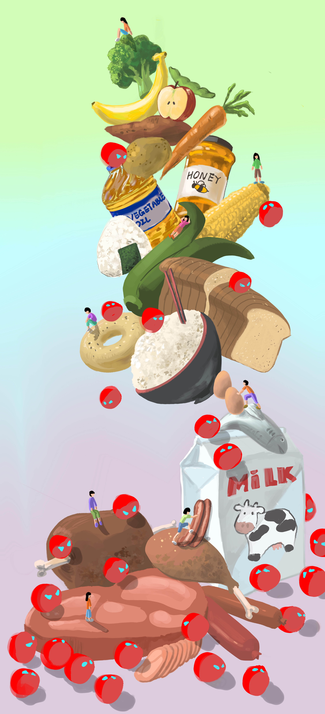

{width=50%} 

# Introduction:

Our project explores the relationship between diet and the infection rate of covid-19. In this presentation, we will go through why we chose this subject, how we constructed our design ideas, what tools we used in the process, and finally, our results.

### Why did we choose this subject?

As I’m sure you’ve noticed, the COVID-19 pandemic has made a drastic change to our everyday lives, and we thought it would be interesting if we could find out something about this topic. We didn’t want to focus too much on heavy subjects on deaths and mortalities, we have enough of that in the news already. Instead we wanted to bring a more positive information about possible daily actions people can take to stay healthy during the pandemic.

### How did we construct our design ideas?

While going through the data on Kaggle^[Ren, Maria. “COVID-19 Healthy Diet Dataset.” Kaggle, 7 Feb. 2021, www.kaggle.com/mariaren/covid19-healthy-diet-dataset.], we came upon Bruno Viera Ribeiro’s finished analysis of the project^[Brunovr. Healthydietvscovid19. 22 Oct. 2020, www.kaggle.com/brunovr/healthydietvscovid19.], and when reading through his process, we found a couple of interesting points that we wanted to zone in by ourselves. One was the possible impact of obesity on COVID-19, to which Bruno investigated the impact on mortality rate while we focused on infected populations. Bruno had also split the obesity category into two levels, high and low, while we split it into three, high, medium, and low, for more detailed investigation. Lastly, we wanted to know what types of food in particular may have an impact on Covid-19 infection rates, which we did using regression analysis

### What did we use?

For our project, we used R, Tableau, and Procreate.

# Wrangling Data:

```{r global_options, include=FALSE, }
knitr::opts_chunk$set(warning = FALSE, message = FALSE)
```

```{r}
library(plotly)
library(tidyverse)

covid <- read_csv("Food_Supply_kcal_Data.csv%3FX-Goog-Algorithm=GOOG4-RSA-SHA256&X-Goog-Credential=gcp-kaggle-com@kaggle-161607.iam.gserviceaccount.com%2F20210326%2Fauto%2Fstorage%2Fgoog4_request&X-Goog-Date=20210326T180241Z&X-Goog-E.csv") 

cleaned <- covid%>% filter(!(is.na(Obesity)|is.na(Confirmed)))

Percentile_33  = quantile(cleaned$Obesity, 0.33333)
Percentile_67  = quantile(cleaned$Obesity, 0.66667)
min_obesity <- min(cleaned$Obesity)
max_obesity <- max(cleaned$Obesity)

cleaned <- cleaned %>% mutate(ObesityCat = cut(Obesity,c(min_obesity-0.1, Percentile_33, Percentile_67, max_obesity), labels = c("low", "medium", "high")))
```

# Data visualization:

### Obesity and Infection Rate:

We started our investigation with obesity rates. We first grouped the countries by 3 obesity levels, then plotted against covid infection rates, or, the percentage of confirmed cases.In this figure, we can see that countries at a lower obesity level have a lower infection rate.

<br>

{width=70%} 

<br>

Then, we focused on Animal and Vegetal food intake of different countries. We can observe that countries with a higher obesity rate have a higher intake of Animal Products and a lower intake of Vegetal Products in terms of calories.

<br>

{width=70%} 

<br>
<br>

{width=70%} 

<br>
<br>

{width=70%} 

### Diet and Obesity:


```{r}

DietData <- read.csv("categorized.csv")

animal_features <- c('Animal.fats', 'Aquatic.Products..Other', 'Eggs',
                     'Fish..Seafood', 'Meat','Milk...Excluding.Butter',
                     'Offals')
vegetal_features <- c('Alcoholic.Beverages','Cereals...Excluding.Beer',
                      'Fruits...Excluding.Wine', 'Miscellaneous',
                      'Oilcrops', 'Pulses', 'Spices', 'Starchy.Roots',
                      'Stimulants', 'Sugar...Sweeteners','Sugar.Crops',
                      'Treenuts', 'Vegetable.Oils', 'Vegetables')

DietData_Mean_A <- DietData  %>%
  #group_by(ObesityCat) %>%
  summarize(across(.cols = all_of(animal_features), .fns = mean)) %>%
  rename(
    `Animal fats` = Animal.fats,
    `Aquatic Products Other` = Aquatic.Products..Other,
    `Eggs` = Eggs,
    `Fish, Seafood` = Fish..Seafood,
    `Meat` = Meat,
    `Milk - Excluding.Butter` = Milk...Excluding.Butter,
    `Offals` = Offals
    )

Names <- DietData_Mean_A$ObesityCat

DietData_Mean_T_A <- as.data.frame(t(DietData_Mean_A[,-1]))
colnames(DietData_Mean_T_A) <- Names

DietData_Categorized_A <- data.frame("Categories"=rownames(DietData_Mean_T_A), 
                                     DietData_Mean_T_A)

figa <- plot_ly(DietData_Categorized_A, 
               labels = ~Categories, 
               values = ~DietData_Mean_T_A, 
               type = 'pie') %>% 
  layout(title = 'Mean food intake by Animal products groups')
```

#### Pie Chart

<br>

```{r, out.width = '80%', echo=FALSE}
figa
```

```{r}
DietData_Mean_V <- DietData  %>%
  #group_by(ObesityCat) %>%
  summarize(across(.cols = all_of(vegetal_features), .fns = mean)) %>%
  rename(
    `Alcoholic Beverages` = Alcoholic.Beverages,
    `Cereals - Excluding Beer` = Cereals...Excluding.Beer,
    `Fruits - Excluding Wine` = Fruits...Excluding.Wine,
    `Miscellaneous` = Miscellaneous,
    `Oilcrops` = Oilcrops,
    `Pulses` = Pulses,
    `Spices` = Spices,
    `Starchy Roots` = Starchy.Roots,
    `Stimulants` = Stimulants,
    `Sugar Sweeteners` = Sugar...Sweeteners,
    `Sugar Crops` = Sugar.Crops,
    `Treenuts` = Treenuts,
    `Vegetable Oils` = Vegetable.Oils,
    `Vegetables` = Vegetables,
    )

Names <- DietData_Mean_V$ObesityCat

DietData_Mean_T_V <- as.data.frame(t(DietData_Mean_V[,-1]))
colnames(DietData_Mean_T_V) <- Names

DietData_Categorized_V <- data.frame("Categories"=rownames(DietData_Mean_T_V), DietData_Mean_T_V)

figb <- plot_ly(DietData_Categorized_V, 
               labels = ~Categories, 
               values = ~DietData_Mean_T_V, 
               type = 'pie') %>% 
  layout(title = 'Mean food intake by Vegetal products groups')
```

```{r, out.width = '80%',, echo=FALSE}
figb
```

We first try to visualize people’s diet with two pie chars and show how different food contribute to people’s calories intake on average. For example, the blue slice in the first pie chart shows that meat contribute 48.2% of people’s average calories intake in animal product. The second pie chart visualize similar story on vegetal product.

```{r}
DietData_Mean <- DietData  %>%
  group_by(ObesityCat) %>%
  summarise(across(.cols = all_of(animal_features), .fns = mean)) %>%
  rename(
    `Animal fats` = Animal.fats,
    `Aquatic Products Other` = Aquatic.Products..Other,
    `Eggs` = Eggs,
    `Fish, Seafood` = Fish..Seafood,
    `Meat` = Meat,
    `Milk - Excluding.Butter` = Milk...Excluding.Butter,
    `Offals` = Offals
    )

Names_All <- DietData_Mean$ObesityCat

DietData_Mean_T <- as.data.frame(t(DietData_Mean[,-1]))
colnames(DietData_Mean_T) <- Names_All

DietData_Categorized <- data.frame("Categories"=rownames(DietData_Mean_T), 
                                   DietData_Mean_T)

fig1 <- plot_ly(DietData_Categorized, 
                x = ~Categories, 
                y = ~high, type = 'bar', 
                name = 'High Obesity')
fig1 <- fig1 %>% add_trace(y = ~medium, name = 'Medium Obesity')
fig1 <- fig1 %>% add_trace(y = ~low, name = 'Low Obesity')
fig1 <- fig1 %>% layout(yaxis = list(title = 'Percentage (%)'),
                        barmode = 'Categories', 
                        title = 'Mean food intake by Animal products')
```

#### Side-by-side Bar Plot

<br>

```{r, out.width = '80%',echo=FALSE}
fig1
```

```{r}
DietData_Mean <- DietData  %>%
  group_by(ObesityCat) %>%
  summarise(across(.cols = all_of(vegetal_features), .fns = mean)) %>%
  rename(
    `Alcoholic Beverages` = Alcoholic.Beverages,
    `Cereals - Excluding Beer` = Cereals...Excluding.Beer,
    `Fruits - Excluding Wine` = Fruits...Excluding.Wine,
    `Miscellaneous` = Miscellaneous,
    `Oilcrops` = Oilcrops,
    `Pulses` = Pulses,
    `Spices` = Spices,
    `Starchy Roots` = Starchy.Roots,
    `Stimulants` = Stimulants,
    `Sugar Sweeteners` = Sugar...Sweeteners,
    `Sugar Crops` = Sugar.Crops,
    `Treenuts` = Treenuts,
    `Vegetable Oils` = Vegetable.Oils,
    `Vegetables` = Vegetables,
    )

Names_All <- DietData_Mean$ObesityCat

DietData_Mean_T <- as.data.frame(t(DietData_Mean[,-1]))
colnames(DietData_Mean_T) <- Names_All

DietData_Categorized <- data.frame("Categories"=rownames(DietData_Mean_T), 
                                   DietData_Mean_T)

fig2 <- plot_ly(DietData_Categorized, 
                x = ~Categories, 
                y = ~high, type = 'bar', 
                name = 'High Obesity')
fig2 <- fig2 %>% add_trace(y = ~medium, name = 'Medium Obesity')
fig2 <- fig2 %>% add_trace(y = ~low, name = 'Low Obesity')
fig2 <- fig2 %>% layout(yaxis = list(title = 'Percentage (%)'), 
                        barmode = 'Categories', 
                        title = 'Mean food intake by Vegetal products')
```

```{r, out.width = '80%',echo=FALSE}
fig2
```

Then we plot two side by side bar plots visualizing how diet is different for different obesity groups. From the first plot, we can clearly see that high and medium obesity groups intake significantly more animal fat, meat and milk product than low obesity group. And when visualizing vegetal products, the difference on cereals is even larger.

```{r,echo=FALSE}
#write.csv(DietData_Categorized,"/Users/macbookpro/Desktop/DietData_Categorized.csv", row.names = FALSE)

#DietData_Selected <- DietData_Categorized[,c('Categories', 'medium')]
#colors<-c("#ff0000","#ff1919","#ff3232","#ff4c4c","#ff6666",
#          "#ff7f7f","#ff9999","#ffb2b2","#ffcccc","#ffe5e5")

#marker = list(colors = ~colors),
```

As we can see, different kinds of food might contribute differently on obesity. But we still don’t know if diet has direct implications for infection rates, which we will explore through regression analysis in the next session.

### Diet and Infection Rate:

So we wanted to see if there was an overall trend of food consumption that correlated with a decrease in confirmed cases. We used a linear model to run the the prediction, and although the foods were all not statistically significant at first, when we went through the list and took out the largest p-values one by one, we were eventually left with a big list of food types that was associated with a decrease of confirmed cases every time there was a unit increase of 1%.

Interestingly, when we investigated the groups of countries with high obesity versus low obesity rates, we had a different list for each group. Also, the list of food for countries of high obesities tended to decrease confirmed cases, which we found interesting because food types like sugar are generally seen as unhealthy, while the food list for countries of low obesity tend to increase confirmed cases. Miscellaneous food was present for both high and low obesity countries.

A note to be cautious of when interpreting our results: there are several assumptions for linear regression that were not satisfied by our data, which is something we would like to address further if there was more time.

```{r, out.width='80%'}
food_influence6 <- lm(Confirmed ~ `Alcoholic Beverages` +`Animal fats`+`Cereals - Excluding Beer` +  `Fish, Seafood` + `Fruits - Excluding Wine` + Meat + `Milk - Excluding Butter` + `Miscellaneous`+Offals + Oilcrops + Pulses + Spices + `Starchy Roots` + `Sugar & Sweeteners` + `Vegetable Oils` +  Vegetables, data = cleaned)

summary(food_influence6)

lowobesity <- cleaned %>% filter(ObesityCat == "low")

highobesity <- cleaned %>% filter(ObesityCat == "high")

food_influence_h1 <- lm(Confirmed ~ `Cereals - Excluding Beer`  + `Miscellaneous`+ Oilcrops+ `Starchy Roots` + `Sugar & Sweeteners` , data = highobesity)
summary(food_influence_h1)

food_influence_L1 <- lm(Confirmed ~ `Milk - Excluding Butter` + `Miscellaneous` + Spices , data = lowobesity)

summary(food_influence_L1)
```

# Artistic Visualization:

### The Drawing

We were inspired by Sonja Kuijpers’ visualization  “A View on Despair” and hoped make a visually engaging representation of what we found with regression analysis.^[Kuijpers, Sonja. “A View on Despair, a Datavisualization Project by STUDIO TERP.” STUDIO TERP, www.studioterp.nl/a-view-on-despair-a-datavisualization-project-by-studio-terp.]

Hence, we decided to create a tower of food. The tower is based on the pie chart Winnie showed, and the amount of different kinds of food all accord with their percentages. The bottom of the tower is constructed by Animal products, which are mainly meat, followed by milk, seafood, and eggs; then it goes into Vegetal products, with the highest percentage is the cereals, then vegetable oils, sugar sweeteners, starchy roots, fruits, pulses and vegetables. The red blobs represent Covid-19 viruses; their density becomes lower as the tower grows. The higher people climb on the tower, meaning the higher percentage of Vegetal products consumed, the less likely they are to encounter Covid-19.

<br>

{width=70%}

<br>

### What would you  want to do if you had more time?

If we had more time, we would like to be able to control for the possible confounding variables that may have influenced the infection rates through ways other than food, such as lockdown policy and political and social conflicts that arose during the pandemic. However, seeing that we don’t have any more time, we will conclude our presentation.
